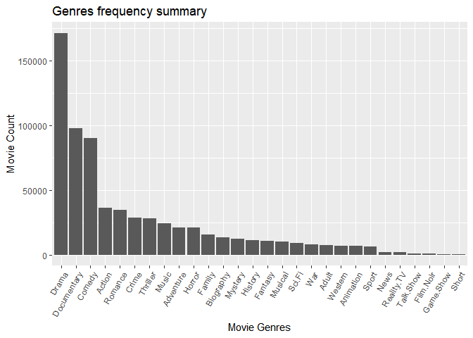
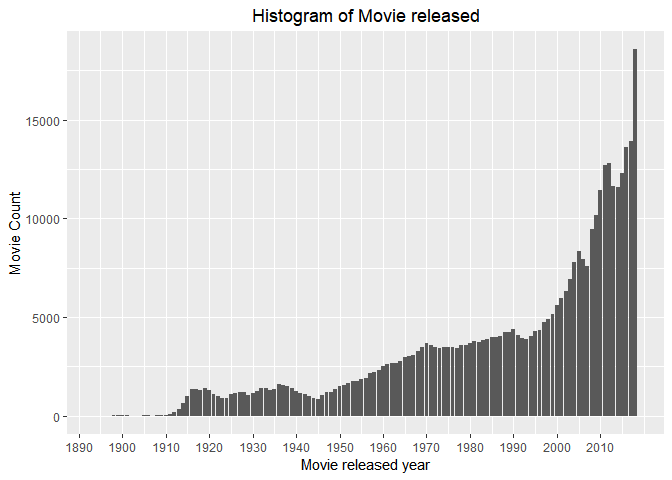
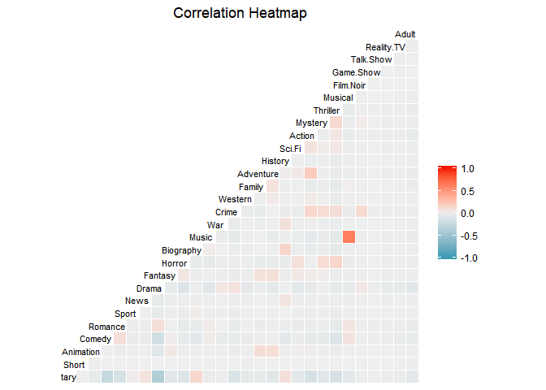
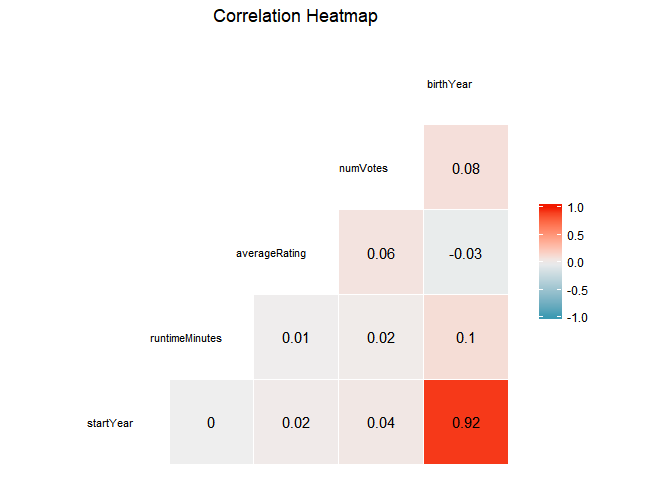

Movie genre classification using IMDb data
================
DD
December 12, 2018

-   [Summary of Key Findings](#summary-of-key-findings)
-   [Problem Statement](#problem-statement)
-   [Data Profile](#data-profile)
-   [Exploratory Data Analysis](#exploratory-data-analysis)
    -   [Load Data](#load-data)
    -   [Tidy Data](#tidy-data)
    -   [Split Genres](#split-genres)
-   [Data Cleaning](#data-cleaning)
    -   [Missing Values](#missing-values)
    -   [Data Type](#data-type)
-   [Data Visualization](#data-visualization)
-   [Modeling](#modeling)
    -   [Data preparation](#data-preparation)
    -   [Split training and test dataset](#split-training-and-test-dataset)
    -   [Algorithm adaptation methods](#algorithm-adaptation-methods)
    -   [Resampling method](#resampling-method)
    -   [Result Interpretation](#result-interpretation)
-   [Future Work](#future-work)
-   [References](#references)

``` r
suppressPackageStartupMessages({
  library(devtools)
  library(knitr)

  library(MASS)
  library(dplyr)
  library(ggplot2)
  library(kableExtra)
  library(tidyverse)
  library(stringr)
  library(data.table)
  
# mlr
  library(mlbench)
  library(mlr)
  library(randomForestSRC)
  library(caret)
  
  library(kableExtra)
})


RUN <- FALSE
```

Summary of Key Findings
=======================

-   The most popular movie genres are drama, documentary, comedy, action and romance. The least popular movie genres are short, game show, film noir and talk show. As the least popular genres are irrelavant and caused unevenness, they are not included in this analysis.

-   Two algorithms were performed (random ferns multilabel algorithm and multivariate random forest), with six differnt algorithm adaptation methods. The models was represented as multiple binary trees in order to simplify the problem. The best model were resampled, however the accuracy did not improved a lot.

-   The model with best presicions are using binery relvance (70%), and nested stacking (79%), and stacked generalization (77%). The model with best F1 are: classifier chains (53%), dependent binary relevance (55%), and stacked generalization (46%). Random forest performs the worst. This suggests an uneven distribution in the training data.

-   Below tables show the prediction accuracy and the misclassification error for each genre. The accuracy is above 90% for most genre, except for comedy, documentary, and drama (70% - 85%). One possible reason is the eneven distribution from the raw data. A stratified sampling method should be applied.

-   Few things needs to improve are as follows:

    -   Downsample the data to make sure it is even.
    -   Feature selection to drop irrelavant variables.
    -   Missing data imputation.

Problem Statement
=================

We’d like to build a system to classify movies by their genre. We have information like the film title, release year, cast and crew, taglines, awards, user ratings, reviews, and of course the primary genre for a total of 3,000 comedies, 1,000 dramas, 500 action adventures, and 20 thrillers. Data profile was summarized in Section

Multilabel classification assigns to each sample a set of target labels. This can be thought as predicting properties of a data-point that are not mutually exclusive, such as topics that are relevant for a document. A text might be about any of religion, politics, finance or education at the same time or none of these.

Data Profile
============

The raw data files (7 tsv.gz files) were parsed and packaged into an R package called IMDB.adata. Columns with pure missing or all text were removed.

The data includes information such as film release year, end year, type, run time (min), genre, rating, director demographics, writer and etc. The director best-known movie was mapped to the director best-known genres.

Exploratory Data Analysis
=========================

Load Data
---------

``` r
# library(IMDB.adata)
# 
# data("title.akas")
# data("title.basics") subset on movie only!!!!!
# data("title.crew")
# data("title.episode")
# data("title.principals")
# data("title.ratings")
# data("name.basics")
# 
# glimpse(title.akas)
# glimpse(title.basics)
# glimpse(title.crew)
# glimpse(title.episode)
# glimpse(title.principals)
# glimpse(title.ratings)
# glimpse(name.basics)
# 
# n = 500
# 
# subset on movie only!!!!!

# title.akas.sample <- sample_n(title.akas, n)  
# title.basics.sample <- sample_n(subset(title.basics,
#                                        titleType %in% c('movie', 'tvMovie')), n)
# title.crew.sample <- sample_n(title.crew, n) 
# title.episode.sample <- sample_n(title.episode, n)
# title.principals.sample <- sample_n(title.principals, n)
# title.ratings.sample <- sample_n(title.ratings, n)
# name.basics.sample <- sample_n(name.basics, n)
# 
# save(title.akas.sample, title.basics.sample, title.crew.sample, title.episode.sample, title.principals.sample, title.ratings.sample, name.basics.sample, file = 'sample_data.RData')

# save(title.akas, title.basics, title.crew, title.episode, title.principals, title.ratings, name.basics, file = 'raw_data.RData')

# load('sample_data.RData')
# load('raw_data.RData')
# load('tidy_name_title_demographics.RData')

# unique_genres <- unique(na.omit(unlist(str_split(title.basics$genres, ","))))
```

``` r
load('fullset.rda')
load('unique_genres.rda')
```

Tidy Data
---------

The movie title was replicated (ordering &gt; 1) due to title change at different regions. The data was processed to keep individual-level data for title. In the table name.basics, the movie titles the person was most often credited were mapped to the title genre, i.e., multiple columns were generated to indicate the genre a person was most credited.

``` r
######################################
# name.basics.distinct: The genre of the best known titles per person 
######################################

# title-genre mapping file
title.genre <- title.basics %>% select(tconst, genres) 

# name.basics: name, demographics, known for titles
temp <- data.frame(str_split(name.basics$knownForTitles, ",", simplify = TRUE), stringsAsFactors = F)
temp <- temp %>% 
  left_join(title.genre, by = c('X1' = 'tconst')) %>%
  left_join(title.genre, by = c('X2' = 'tconst')) %>%
  left_join(title.genre, by = c('X3' = 'tconst')) %>%
  left_join(title.genre, by = c('X4' = 'tconst')) %>%
  left_join(title.genre, by = c('X5' = 'tconst')) %>%
  left_join(title.genre, by = c('X6' = 'tconst')) %>%
  left_join(title.genre, by = c('X7' = 'tconst')) 

# Best known genre with freq 
xx <- apply(temp[8:14], 1, paste, collapse=',')
kf.matrix <- sapply(unique_genres, function(i) str_count(xx, i))

# Bind best know genre
name.basics.distinct <- name.basics %>% 
  select(nconst, birthYear) %>%
  cbind(kf.matrix)

rm(temp, xx, kf.matrix)

######################################
# title.akas.distinct: titleID, titleChanged (0-original title) 
######################################

# Generate dataset based on unique Title ID 
title.akas.distinct <- title.akas %>%
  subset(!is.na(titleId) & !is.na(isOriginalTitle)) %>%
  group_by(titleId) %>%
  summarise(titleChanged = max(isOriginalTitle)) 

# save(name.basics.distinct, title.akas.distinct, file = 'tidy_name_title_demographics.RData')
```

``` r
# load('tidy_name_title_demographics.RData')
# rename
# colnames(name.basics.distinct)[3:ncol(name.basics.distinct)] <- 
#   paste0('kf.', colnames(name.basics.distinct)[3:ncol(name.basics.distinct)])

title.akas.distinct %>% head() %>% kable()
name.basics.distinct %>% head() %>% kable()
```

Split Genres
------------

The genres we have are Action, , Adult, , Adventure, , Animation, , Biography, , Comedy, , Crime, , Documentary, , Drama, , Family, , Fantasy, , Film.Noir, , Game.Show, , History, , Horror, , Music, , Musical, , Mystery, , News, , Reality.TV, , Romance, , Sci.Fi, , Short, , Sport, , Talk.Show, , Thriller, , War, , Western,

``` r
# movie subset
movie.sub <- title.basics %>% subset(titleType %in% c('movie', 'tvMovie'))

# Create Genres (DV) matrix 
DV.matrix <- sapply(unique_genres, function(i) grepl(i, movie.sub$genres))

# Bind best know genre
title.basics.movie <- movie.sub %>% 
  subset(titleType %in% c('movie', 'tvMovie')) %>%
  dplyr::select(-primaryTitle, -originalTitle) %>%
  cbind(DV.matrix)

# print
title.basics.movie %>% data.frame() %>% head() %>% kable()
```

Data Cleaning
=============

``` r
# join data 
combined_data <- title.basics.movie %>%
  left_join(title.akas.distinct, by = c('tconst' = "titleId")) %>%
  left_join(title.crew, by = "tconst") %>%   # title-director-writer mapping
  left_join(title.episode, by = "tconst") %>% # title, parent title, season #, episode #
  # left_join(title.principals, by = c("tconst")) %>% #title, name,
  left_join(title.ratings, by = "tconst") %>% # title, rating score and count
  left_join(name.basics.distinct, by = c("directors" = "nconst")) %>%   # name, demographics, known for titles
  ungroup()

# save(combined_data,movie.sub, title.basics.movie, file = 'fullset.rda')

# Summarize combined dataset by each column.
# summarizeColumns(combined_data) %>%
  # kable(digits = 2)

colSums(combined_data[,label])
```

``` r
unique_genres <- unique(na.omit(unlist(str_split(combined_data$genres, ","))))
# format label
names(combined_data) <- gsub('_', '.', names(combined_data))
names(combined_data) <- gsub('-', '.', names(combined_data))
unique_genres <- gsub('_', '.', unique_genres)
unique_genres <- gsub('-', '.', unique_genres)

unique_genres
```

    ##  [1] "Romance"     "Documentary" "News"        "Sport"       "Biography"  
    ##  [6] "Drama"       "Crime"       "Adventure"   "Fantasy"     "Comedy"     
    ## [11] "War"         "Family"      "History"     "Sci.Fi"      "Western"    
    ## [16] "Thriller"    "Mystery"     "Horror"      "Action"      "Music"      
    ## [21] "Short"       "Animation"   "Musical"     "Film.Noir"   "Talk.Show"  
    ## [26] "Adult"       "Reality.TV"  "Game.Show"

The full dataset is a 440k by 68 matrix.

Missing Values
--------------

Before splitting the data for training, check missingness, column type, merge small groups, and drop columns.

-   Columns were removed if all are missing (movie end year, season number, episode number, parent title). The missingness for each input was listed as below.
-   Rows were removed if the genres is missing.

``` r
# Summary of missingness in % by each column
sapply(combined_data, function(x) round(sum(is.na(x))/nrow(combined_data)*100, 2))
```

    ##         tconst      titleType        isAdult      startYear        endYear 
    ##           0.00           0.00           0.00           7.12         100.00 
    ## runtimeMinutes         genres    Documentary          Short      Animation 
    ##          36.24          15.01           0.00           0.00           0.00 
    ##         Comedy        Romance          Sport           News          Drama 
    ##           0.00           0.00           0.00           0.00           0.00 
    ##        Fantasy         Horror      Biography          Music            War 
    ##           0.00           0.00           0.00           0.00           0.00 
    ##          Crime        Western         Family      Adventure        History 
    ##           0.00           0.00           0.00           0.00           0.00 
    ##         Sci.Fi         Action        Mystery       Thriller        Musical 
    ##           0.00           0.00           0.00           0.00           0.00 
    ##      Film.Noir      Game.Show      Talk.Show     Reality.TV          Adult 
    ##           0.00           0.00           0.00           0.00           0.00 
    ##   titleChanged      directors        writers   parentTconst   seasonNumber 
    ##          36.91           9.73          25.92         100.00         100.00 
    ##  episodeNumber  averageRating       numVotes      birthYear kf.Documentary 
    ##         100.00          54.39          54.39          56.39          25.04 
    ##       kf.Short   kf.Animation      kf.Comedy     kf.Romance       kf.Sport 
    ##          25.04          25.04          25.04          25.04          25.04 
    ##        kf.News       kf.Drama     kf.Fantasy      kf.Horror   kf.Biography 
    ##          25.04          25.04          25.04          25.04          25.04 
    ##       kf.Music         kf.War       kf.Crime     kf.Western      kf.Family 
    ##          25.04          25.04          25.04          25.04          25.04 
    ##   kf.Adventure     kf.History      kf.Sci.Fi      kf.Action     kf.Mystery 
    ##          25.04          25.04          25.04          25.04          25.04 
    ##    kf.Thriller     kf.Musical   kf.Film.Noir   kf.Game.Show   kf.Talk.Show 
    ##          25.04          25.04          25.04          25.04          25.04 
    ##  kf.Reality.TV       kf.Adult 
    ##          25.04          25.04

``` r
# Visualization
# missing.values <- VIM::aggr(combined_data, sortVars = T, prop = T, 
#                             sortCombs = F, cex.lab = 1.5, cex.axis = .6, 
#                             cex.numbers = 5, combined = F, gap = -.2)

# remove empty columns
combined_data <- combined_data %>% 
  select_if(function(x) !(all(is.na(x)) | all(x==""))) %>%
  subset(!is.na(genres))
# sum(complete.cases(combined_data))
```

Data Type
---------

``` r
# "region", "language", "types", "attributes", 
combined_data <- combined_data %>%
  mutate_at(
    .vars = vars("titleChanged", "isAdult", "genres"),
    .funs = funs(as.factor(.))
  ) %>%
  mutate_at(
    .vars = vars(unique_genres),
    .funs = funs(as.logical(.)) # multilable classification; 
                                # as.factor for classification
  ) 
```

Data Visualization
==================

Plot the top genres by frequency

``` r
comb_summary <- data.table(Genres = unique_genres, 
                           N = sapply(combined_data[,unique_genres], sum))[order(N)]

# top 20 genres
top.genres <- top_n(comb_summary, wt = N, 22)

ggplot(comb_summary) + 
  geom_bar(aes(x = reorder(Genres, -N, min), y = N), stat="identity") +
  ggtitle("Genres frequency summary") + 
  xlab('Movie Genres') + ylab('Movie Count') +
  theme(axis.text.x = element_text(angle = 60, hjust = 1))
```



Plot the top rate moview

``` r
temp = movie.sub %>% select(-endYear, -titleType)
  
top_10 <- combined_data %>%
  subset(!is.na(genres)) %>%
  # mutate(score = numVotes * averageRating) %>%
  arrange(desc(numVotes)) %>%
  top_n(10, numVotes) %>%
  select(tconst, averageRating, numVotes, birthYear) %>%
  left_join(temp, by = 'tconst')

# DT::datatable(top_10, caption = 'Most popular movies (top 10 voted)')
top_10 %>% kable(caption = 'Most popular movies (top 10 voted)')
```

<table>
<caption>
Most popular movies (top 10 voted)
</caption>
<thead>
<tr>
<th style="text-align:left;">
tconst
</th>
<th style="text-align:right;">
averageRating
</th>
<th style="text-align:right;">
numVotes
</th>
<th style="text-align:right;">
birthYear
</th>
<th style="text-align:left;">
primaryTitle
</th>
<th style="text-align:left;">
originalTitle
</th>
<th style="text-align:right;">
isAdult
</th>
<th style="text-align:right;">
startYear
</th>
<th style="text-align:right;">
runtimeMinutes
</th>
<th style="text-align:left;">
genres
</th>
</tr>
</thead>
<tbody>
<tr>
<td style="text-align:left;">
tt0111161
</td>
<td style="text-align:right;">
9.3
</td>
<td style="text-align:right;">
2024249
</td>
<td style="text-align:right;">
1959
</td>
<td style="text-align:left;">
The Shawshank Redemption
</td>
<td style="text-align:left;">
The Shawshank Redemption
</td>
<td style="text-align:right;">
0
</td>
<td style="text-align:right;">
1994
</td>
<td style="text-align:right;">
142
</td>
<td style="text-align:left;">
Drama
</td>
</tr>
<tr>
<td style="text-align:left;">
tt0468569
</td>
<td style="text-align:right;">
9.0
</td>
<td style="text-align:right;">
1991971
</td>
<td style="text-align:right;">
1970
</td>
<td style="text-align:left;">
The Dark Knight
</td>
<td style="text-align:left;">
The Dark Knight
</td>
<td style="text-align:right;">
0
</td>
<td style="text-align:right;">
2008
</td>
<td style="text-align:right;">
152
</td>
<td style="text-align:left;">
Action,Crime,Drama
</td>
</tr>
<tr>
<td style="text-align:left;">
tt1375666
</td>
<td style="text-align:right;">
8.8
</td>
<td style="text-align:right;">
1771807
</td>
<td style="text-align:right;">
1970
</td>
<td style="text-align:left;">
Inception
</td>
<td style="text-align:left;">
Inception
</td>
<td style="text-align:right;">
0
</td>
<td style="text-align:right;">
2010
</td>
<td style="text-align:right;">
148
</td>
<td style="text-align:left;">
Action,Adventure,Sci-Fi
</td>
</tr>
<tr>
<td style="text-align:left;">
tt0137523
</td>
<td style="text-align:right;">
8.8
</td>
<td style="text-align:right;">
1619521
</td>
<td style="text-align:right;">
1962
</td>
<td style="text-align:left;">
Fight Club
</td>
<td style="text-align:left;">
Fight Club
</td>
<td style="text-align:right;">
0
</td>
<td style="text-align:right;">
1999
</td>
<td style="text-align:right;">
139
</td>
<td style="text-align:left;">
Drama
</td>
</tr>
<tr>
<td style="text-align:left;">
tt0110912
</td>
<td style="text-align:right;">
8.9
</td>
<td style="text-align:right;">
1580315
</td>
<td style="text-align:right;">
1963
</td>
<td style="text-align:left;">
Pulp Fiction
</td>
<td style="text-align:left;">
Pulp Fiction
</td>
<td style="text-align:right;">
0
</td>
<td style="text-align:right;">
1994
</td>
<td style="text-align:right;">
154
</td>
<td style="text-align:left;">
Crime,Drama
</td>
</tr>
<tr>
<td style="text-align:left;">
tt0109830
</td>
<td style="text-align:right;">
8.8
</td>
<td style="text-align:right;">
1543641
</td>
<td style="text-align:right;">
1951
</td>
<td style="text-align:left;">
Forrest Gump
</td>
<td style="text-align:left;">
Forrest Gump
</td>
<td style="text-align:right;">
0
</td>
<td style="text-align:right;">
1994
</td>
<td style="text-align:right;">
142
</td>
<td style="text-align:left;">
Drama,Romance
</td>
</tr>
<tr>
<td style="text-align:left;">
tt0120737
</td>
<td style="text-align:right;">
8.8
</td>
<td style="text-align:right;">
1457359
</td>
<td style="text-align:right;">
1961
</td>
<td style="text-align:left;">
The Lord of the Rings: The Fellowship of the Ring
</td>
<td style="text-align:left;">
The Lord of the Rings: The Fellowship of the Ring
</td>
<td style="text-align:right;">
0
</td>
<td style="text-align:right;">
2001
</td>
<td style="text-align:right;">
178
</td>
<td style="text-align:left;">
Adventure,Drama,Fantasy
</td>
</tr>
<tr>
<td style="text-align:left;">
tt0133093
</td>
<td style="text-align:right;">
8.7
</td>
<td style="text-align:right;">
1452417
</td>
<td style="text-align:right;">
NA
</td>
<td style="text-align:left;">
The Matrix
</td>
<td style="text-align:left;">
The Matrix
</td>
<td style="text-align:right;">
0
</td>
<td style="text-align:right;">
1999
</td>
<td style="text-align:right;">
136
</td>
<td style="text-align:left;">
Action,Sci-Fi
</td>
</tr>
<tr>
<td style="text-align:left;">
tt0167260
</td>
<td style="text-align:right;">
8.9
</td>
<td style="text-align:right;">
1440742
</td>
<td style="text-align:right;">
1961
</td>
<td style="text-align:left;">
The Lord of the Rings: The Return of the King
</td>
<td style="text-align:left;">
The Lord of the Rings: The Return of the King
</td>
<td style="text-align:right;">
0
</td>
<td style="text-align:right;">
2003
</td>
<td style="text-align:right;">
201
</td>
<td style="text-align:left;">
Action,Adventure,Drama
</td>
</tr>
<tr>
<td style="text-align:left;">
tt0068646
</td>
<td style="text-align:right;">
9.2
</td>
<td style="text-align:right;">
1387436
</td>
<td style="text-align:right;">
1939
</td>
<td style="text-align:left;">
The Godfather
</td>
<td style="text-align:left;">
The Godfather
</td>
<td style="text-align:right;">
0
</td>
<td style="text-align:right;">
1972
</td>
<td style="text-align:right;">
175
</td>
<td style="text-align:left;">
Crime,Drama
</td>
</tr>
</tbody>
</table>
Plot the release year of the movies

``` r
ggplot(combined_data, 
       aes(x = pmin(startYear, 2018))) +
  geom_bar() +
  scale_x_continuous(breaks = seq(1890, 2018, by = 10)) +
  xlab("Movie released year") + 
  ylab('Movie Count') + 
  ggtitle("Histogram of Movie released") +
  theme(plot.title = element_text(hjust = 0.5))
```

    ## Warning: Removed 35636 rows containing non-finite values (stat_count).



Plot the correlation between the genres

``` r
data_here <- combined_data %>% mutate_at(.vars = vars(unique_genres), .funs = funs(as.numeric(.)))

GGally::ggcorr(data_here[7:34], label = FALSE, 
               label_round = 2, label_size = 4, size = 3, hjust = .85) +
  ggtitle("Correlation Heatmap") +
  theme(plot.title = element_text(hjust = 0.5))
```



Plot the correlation between the input variables

``` r
GGally::ggcorr(combined_data[,1:40], label = TRUE, 
               label_round = 2, label_size = 4, size = 3, hjust = .85) +
  ggtitle("Correlation Heatmap") +
  theme(plot.title = element_text(hjust = 0.5))
```

    ## Warning in GGally::ggcorr(combined_data[, 1:40], label = TRUE, label_round
    ## = 2, : data in column(s) 'tconst', 'titleType', 'isAdult', 'genres',
    ## 'Documentary', 'Short', 'Animation', 'Comedy', 'Romance', 'Sport', 'News',
    ## 'Drama', 'Fantasy', 'Horror', 'Biography', 'Music', 'War', 'Crime',
    ## 'Western', 'Family', 'Adventure', 'History', 'Sci.Fi', 'Action', 'Mystery',
    ## 'Thriller', 'Musical', 'Film.Noir', 'Game.Show', 'Talk.Show', 'Reality.TV',
    ## 'Adult', 'titleChanged', 'directors', 'writers' are not numeric and were
    ## ignored



Modeling
========

Data preparation
----------------

``` r
combined_data <- createDummyFeatures(combined_data, 
                                 target = unique_genres, 
                                 cols = c("titleChanged", "isAdult"))

# normalize features
combined_data <- normalizeFeatures(combined_data, target = unique_genres, method = "standardize")

glimpse(combined_data)
```

    ## Observations: 440,338
    ## Variables: 70
    ## $ tconst         <chr> "tt0000009", "tt0000147", "tt0000335", "tt00005...
    ## $ titleType      <chr> "movie", "movie", "movie", "movie", "movie", "m...
    ## $ startYear      <dbl> -3.501172, -3.390391, -3.279611, -3.058051, -3....
    ## $ runtimeMinutes <dbl> -0.3882296, -0.6246799, NA, -0.1517794, NA, NA,...
    ## $ genres         <fct> Romance, Documentary,News,Sport, Biography,Dram...
    ## $ Documentary    <lgl> FALSE, TRUE, FALSE, FALSE, FALSE, FALSE, FALSE,...
    ## $ Short          <lgl> FALSE, FALSE, FALSE, FALSE, FALSE, FALSE, FALSE...
    ## $ Animation      <lgl> FALSE, FALSE, FALSE, FALSE, FALSE, FALSE, FALSE...
    ## $ Comedy         <lgl> FALSE, FALSE, FALSE, FALSE, FALSE, FALSE, FALSE...
    ## $ Romance        <lgl> TRUE, FALSE, FALSE, FALSE, FALSE, FALSE, FALSE,...
    ## $ Sport          <lgl> FALSE, TRUE, FALSE, FALSE, FALSE, FALSE, FALSE,...
    ## $ News           <lgl> FALSE, TRUE, FALSE, FALSE, FALSE, FALSE, FALSE,...
    ## $ Drama          <lgl> FALSE, FALSE, TRUE, TRUE, TRUE, TRUE, TRUE, TRU...
    ## $ Fantasy        <lgl> FALSE, FALSE, FALSE, FALSE, FALSE, FALSE, FALSE...
    ## $ Horror         <lgl> FALSE, FALSE, FALSE, FALSE, FALSE, FALSE, FALSE...
    ## $ Biography      <lgl> FALSE, FALSE, TRUE, TRUE, FALSE, FALSE, FALSE, ...
    ## $ Music          <lgl> FALSE, FALSE, FALSE, FALSE, FALSE, FALSE, FALSE...
    ## $ War            <lgl> FALSE, FALSE, FALSE, FALSE, FALSE, FALSE, FALSE...
    ## $ Crime          <lgl> FALSE, FALSE, FALSE, TRUE, FALSE, FALSE, FALSE,...
    ## $ Western        <lgl> FALSE, FALSE, FALSE, FALSE, FALSE, FALSE, FALSE...
    ## $ Family         <lgl> FALSE, FALSE, FALSE, FALSE, FALSE, FALSE, FALSE...
    ## $ Adventure      <lgl> FALSE, FALSE, FALSE, FALSE, FALSE, FALSE, FALSE...
    ## $ History        <lgl> FALSE, FALSE, FALSE, FALSE, FALSE, FALSE, FALSE...
    ## $ Sci.Fi         <lgl> FALSE, FALSE, FALSE, FALSE, FALSE, FALSE, FALSE...
    ## $ Action         <lgl> FALSE, FALSE, FALSE, FALSE, FALSE, FALSE, FALSE...
    ## $ Mystery        <lgl> FALSE, FALSE, FALSE, FALSE, FALSE, FALSE, FALSE...
    ## $ Thriller       <lgl> FALSE, FALSE, FALSE, FALSE, FALSE, FALSE, FALSE...
    ## $ Musical        <lgl> FALSE, FALSE, FALSE, FALSE, FALSE, FALSE, FALSE...
    ## $ Film.Noir      <lgl> FALSE, FALSE, FALSE, FALSE, FALSE, FALSE, FALSE...
    ## $ Game.Show      <lgl> FALSE, FALSE, FALSE, FALSE, FALSE, FALSE, FALSE...
    ## $ Talk.Show      <lgl> FALSE, FALSE, FALSE, FALSE, FALSE, FALSE, FALSE...
    ## $ Reality.TV     <lgl> FALSE, FALSE, FALSE, FALSE, FALSE, FALSE, FALSE...
    ## $ Adult          <lgl> FALSE, FALSE, FALSE, FALSE, FALSE, FALSE, FALSE...
    ## $ directors      <chr> "nm0085156", "nm0714557", "nm0095714,nm0675140"...
    ## $ writers        <chr> "nm0085156", NA, NA, "nm0846879", "nm0092809,nm...
    ## $ averageRating  <dbl> -0.520054622, -0.821421516, 0.007337442, -0.068...
    ## $ numVotes       <dbl> -0.09995489, -0.09293643, -0.10128176, -0.08553...
    ## $ birthYear      <dbl> -2.615552, -2.473662, NA, -2.296299, -2.544607,...
    ## $ kf.Documentary <dbl> -0.4416084, 1.6957715, NA, -0.4416084, -0.44160...
    ## $ kf.Short       <dbl> -0.3790567, 1.3531144, NA, -0.3790567, 1.353114...
    ## $ kf.Animation   <dbl> -0.1277268, -0.1277268, NA, -0.1277268, -0.1277...
    ## $ kf.Comedy      <dbl> -0.7259689, -0.7259689, NA, -0.7259689, -0.7259...
    ## $ kf.Romance     <dbl> 0.7511058, -0.5790797, NA, -0.5790797, -0.57907...
    ## $ kf.Sport       <dbl> -0.1573839, 4.7257103, NA, -0.1573839, -0.15738...
    ## $ kf.News        <dbl> -0.08512274, 9.26683129, NA, -0.08512274, -0.08...
    ## $ kf.Drama       <dbl> -1.2138473, -1.2138473, NA, -0.4541513, 0.30554...
    ## $ kf.Fantasy     <dbl> -0.2974959, -0.2974959, NA, -0.2974959, -0.2974...
    ## $ kf.Horror      <dbl> -0.3280766, -0.3280766, NA, -0.3280766, -0.3280...
    ## $ kf.Biography   <dbl> -0.2837258, -0.2837258, NA, 2.7089005, -0.28372...
    ## $ kf.Music       <dbl> -0.3623256, -0.3623256, NA, -0.3623256, -0.3623...
    ## $ kf.War         <dbl> -0.2465088, -0.2465088, NA, -0.2465088, -0.2465...
    ## $ kf.Crime       <dbl> -0.5167983, -0.5167983, NA, 0.9727316, 0.972731...
    ## $ kf.Western     <dbl> -0.1437431, -0.1437431, NA, -0.1437431, -0.1437...
    ## $ kf.Family      <dbl> -0.2644067, -0.2644067, NA, -0.2644067, -0.2644...
    ## $ kf.Adventure   <dbl> -0.4671827, -0.4671827, NA, -0.4671827, -0.4671...
    ## $ kf.History     <dbl> -0.2848059, -0.2848059, NA, -0.2848059, -0.2848...
    ## $ kf.Sci.Fi      <dbl> -0.3017661, -0.3017661, NA, -0.3017661, -0.3017...
    ## $ kf.Action      <dbl> -0.5472193, -0.5472193, NA, -0.5472193, -0.5472...
    ## $ kf.Mystery     <dbl> -0.3478438, -0.3478438, NA, -0.3478438, -0.3478...
    ## $ kf.Thriller    <dbl> -0.4542405, -0.4542405, NA, -0.4542405, -0.4542...
    ## $ kf.Musical     <dbl> -0.2878851, -0.2878851, NA, -0.2878851, -0.2878...
    ## $ kf.Film.Noir   <dbl> -0.07971242, -0.07971242, NA, -0.07971242, -0.0...
    ## $ kf.Game.Show   <dbl> -0.06182547, -0.06182547, NA, -0.06182547, -0.0...
    ## $ kf.Talk.Show   <dbl> -0.06748756, -0.06748756, NA, -0.06748756, -0.0...
    ## $ kf.Reality.TV  <dbl> -0.09673238, -0.09673238, NA, -0.09673238, -0.0...
    ## $ kf.Adult       <dbl> -0.1245262, -0.1245262, NA, -0.1245262, -0.1245...
    ## $ titleChanged.0 <dbl> -1.1600063, -1.1600063, -1.1600063, -1.1600063,...
    ## $ titleChanged.1 <dbl> 1.1600063, 1.1600063, 1.1600063, 1.1600063, -0....
    ## $ isAdult.0      <dbl> 0.1310433, 0.1310433, 0.1310433, 0.1310433, 0.1...
    ## $ isAdult.1      <dbl> -0.1310433, -0.1310433, -0.1310433, -0.1310433,...

``` r
# Downsampling
# combined_data.copy <- copy(combined_data)
# train.index <- upSample(row.names(combined_data), dim(combined_data)[1]*0.6)

# drop columns
# drop data with genres frequency < 
x = setdiff(unique_genres, top.genres$Genres)
x = setdiff(colnames(combined_data), x)
xx = lapply(x, as.symbol)  
# i = -Short, -Game.Show, -Film.Noir, -Talk.Show, -Reality.TV, -News  

combined_data <- combined_data %>%
  dplyr::select_(.dots = xx) %>%
  dplyr::select(-tconst, -genres, -titleType, -directors, -writers) 
```

Split training and test dataset
-------------------------------

The data was split to three parts: 60% training set, 20% test set, and 20% validation set.

``` r
# Split training and test data
set.seed(123)
train.index <- sample(row.names(combined_data), dim(combined_data)[1]*0.6)
valid.index <- sample(setdiff(row.names(combined_data), train.index), dim(combined_data)[1]*0.2)
test.index <- setdiff(row.names(combined_data), union(train.index, valid.index))

# subtract data
train_set  <- combined_data[train.index, ]
test_set <- combined_data[test.index, ]
valid_set <- combined_data[valid.index, ]
```

``` r
# test a small sample
n = 2000
train_set_sample = sample_n(train_set, n) 
train_set = train_set_sample
```

Algorithm adaptation methods
----------------------------

In this report, I chose two commen algorithm adaptation methods to start with: multivariate random forest in the ***randomForestSRC*** package and the random ferns multilabel algorithm in the ***rFerns*** package. The resulting models was represented as multiple binary trees using the rpart package (Recursive Partitioning) in R.

``` r
# create a task
trainTask <- makeMultilabelTask(id = "multi", data = train_set, target = top.genres$Genres)
testTask <- makeMultilabelTask(id = "multi", data = test_set, target = top.genres$Genres)
validTask <- makeMultilabelTask(id = "multi", data = valid_set, target = top.genres$Genres)

# Problem transformation method
lrn.rfsrc = makeLearner("multilabel.randomForestSRC", predict.type = "prob")
makeRLearnerMultilabel
```

    ## function (cl, package, par.set, par.vals = list(), properties = character(0L), 
    ##     name = cl, short.name = cl, note = "", callees = character(0L)) 
    ## {
    ##     addClasses(makeRLearnerInternal(cl, "multilabel", package, 
    ##         par.set, par.vals, properties, name, short.name, note, 
    ##         callees), c(cl, "RLearnerMultilabel"))
    ## }
    ## <bytecode: 0x000000002c39a398>
    ## <environment: namespace:mlr>

``` r
#Core learner
lrn.core= makeLearner("classif.rpart", predict.type = "prob")

#5 Wrapped learners
lrn.binrel=makeMultilabelBinaryRelevanceWrapper(lrn.core)
lrn.chain=makeMultilabelClassifierChainsWrapper(lrn.core)
lrn.nest=makeMultilabelNestedStackingWrapper(lrn.core)
lrn.dbr= makeMultilabelDBRWrapper(lrn.core)
lrn.stack=makeMultilabelStackingWrapper(lrn.core)


# rFerns learner
library(rFerns)
lrn.rFerns = makeLearner("multilabel.rFerns")
lrn.rFerns
```

    ## Learner multilabel.rFerns from package rFerns
    ## Type: multilabel
    ## Name: Random ferns; Short name: rFerns
    ## Class: multilabel.rFerns
    ## Properties: numerics,factors,ordered
    ## Predict-Type: response
    ## Hyperparameters:

Below tables show the prediction accuracy and the misclassification error for each genre. The accuracy is above 90% for most genre, except for comedy, documentary, and drama.

``` r
#Training 6 models on train subset

# Random forests
mod.rf=mlr::train(lrn.rfsrc,trainTask, subset = 1:1500, weights = rep(1/1500, 1500))
pred.rf = predict(mod.rf, task = trainTask, subset = 1:10)
pred.rf = predict(mod.rf, newdata = train_set[1501:1600,])
getMultilabelBinaryPerformances(pred.rf, measures = list(acc, mmce, auc))
```

    ##             acc.test.mean mmce.test.mean auc.test.mean
    ## Sport                0.98           0.02     0.7500000
    ## Animation            0.97           0.03     0.8969072
    ## Western              0.98           0.02     0.9795918
    ## Adult                1.00           0.00     1.0000000
    ## War                  0.99           0.01     0.3232323
    ## Sci.Fi               0.97           0.03     0.9828179
    ## Musical              0.98           0.02     0.9897959
    ## Fantasy              1.00           0.00            NA
    ## History              1.00           0.00            NA
    ## Mystery              0.99           0.01     0.7575758
    ## Biography            0.98           0.02     0.6785714
    ## Family               0.98           0.02     0.9642857
    ## Horror               0.92           0.08     0.9605978
    ## Adventure            0.98           0.02     0.9591837
    ## Music                0.92           0.08     0.8790761
    ## Thriller             0.97           0.03     0.9072165
    ## Crime                0.93           0.07     0.8018433
    ## Romance              0.93           0.07     0.7050691
    ## Action               0.93           0.07     0.9076087
    ## Comedy               0.86           0.14     0.8157335
    ## Documentary          0.80           0.20     0.8784722
    ## Drama                0.73           0.27     0.8027115

``` r
# binary relevance method
mod.binrel=mlr::train(lrn.binrel,trainTask)
pred.binrel = predict(mod.binrel, task = trainTask, subset = 1:10)
pred.binrel = predict(mod.binrel, newdata = train_set[1501:1600,])
getMultilabelBinaryPerformances(pred.binrel, measures = list(acc, mmce, auc))
```

    ##             acc.test.mean mmce.test.mean auc.test.mean
    ## Sport                0.98           0.02     0.5000000
    ## Animation            0.97           0.03     0.5000000
    ## Western              0.98           0.02     0.9948980
    ## Adult                1.00           0.00     1.0000000
    ## War                  0.99           0.01     0.5000000
    ## Sci.Fi               0.98           0.02     0.9793814
    ## Musical              0.99           0.01     0.9974490
    ## Fantasy              1.00           0.00            NA
    ## History              1.00           0.00            NA
    ## Mystery              0.99           0.01     0.4696970
    ## Biography            0.98           0.02     0.7244898
    ## Family               0.99           0.01     0.7321429
    ## Horror               0.96           0.04     0.8573370
    ## Adventure            0.98           0.02     0.9795918
    ## Music                0.93           0.07     0.7914402
    ## Thriller             0.98           0.02     0.8161512
    ## Crime                0.93           0.07     0.5000000
    ## Romance              0.93           0.07     0.5000000
    ## Action               0.95           0.05     0.7411685
    ## Comedy               0.88           0.12     0.7204111
    ## Documentary          0.82           0.18     0.7873264
    ## Drama                0.75           0.25     0.7805049

``` r
#classifier chains method (CC)
mod.chain=mlr::train(lrn.chain,trainTask)
pred.chain = predict(mod.chain, task = trainTask, subset = 1:10)
pred.chain = predict(mod.chain, newdata = train_set[1501:1600,])
getMultilabelBinaryPerformances(pred.chain, measures = list(acc, mmce, auc))
```

    ##             acc.test.mean mmce.test.mean auc.test.mean
    ## Sport                0.98           0.02     0.5000000
    ## Animation            0.97           0.03     0.5000000
    ## Western              0.98           0.02     0.9948980
    ## Adult                1.00           0.00     1.0000000
    ## War                  0.99           0.01     0.5000000
    ## Sci.Fi               0.98           0.02     0.9793814
    ## Musical              0.99           0.01     0.7448980
    ## Fantasy              1.00           0.00            NA
    ## History              1.00           0.00            NA
    ## Mystery              0.98           0.02     0.4696970
    ## Biography            0.98           0.02     0.7244898
    ## Family               0.99           0.01     0.7321429
    ## Horror               0.96           0.04     0.8573370
    ## Adventure            0.99           0.01     0.9948980
    ## Music                0.93           0.07     0.7914402
    ## Thriller             0.97           0.03     0.8161512
    ## Crime                0.93           0.07     0.5000000
    ## Romance              0.92           0.08     0.5683564
    ## Action               0.95           0.05     0.7411685
    ## Comedy               0.88           0.12     0.7204111
    ## Documentary          0.82           0.18     0.7873264
    ## Drama                0.70           0.30     0.7531557

``` r
#nested stacking method 
mod.nest = mlr::train(lrn.nest,trainTask)
pred.nest = predict(mod.nest, task = trainTask, subset = 1:10)
pred.nest = predict(mod.nest, newdata = train_set[1501:1600,])
getMultilabelBinaryPerformances(pred.nest, measures = list(acc, mmce, auc))
```

    ##             acc.test.mean mmce.test.mean auc.test.mean
    ## Sport                0.98           0.02     0.5000000
    ## Animation            0.97           0.03     0.5000000
    ## Western              0.98           0.02     0.9948980
    ## Adult                1.00           0.00     1.0000000
    ## War                  0.99           0.01     0.5000000
    ## Sci.Fi               0.98           0.02     0.9862543
    ## Musical              0.99           0.01     0.9974490
    ## Fantasy              1.00           0.00            NA
    ## History              1.00           0.00            NA
    ## Mystery              0.99           0.01     0.4696970
    ## Biography            0.98           0.02     0.7244898
    ## Family               0.99           0.01     0.7321429
    ## Horror               0.96           0.04     0.8573370
    ## Adventure            0.98           0.02     0.9795918
    ## Music                0.93           0.07     0.7914402
    ## Thriller             0.98           0.02     0.8161512
    ## Crime                0.93           0.07     0.5000000
    ## Romance              0.93           0.07     0.5000000
    ## Action               0.95           0.05     0.7411685
    ## Comedy               0.88           0.12     0.7204111
    ## Documentary          0.82           0.18     0.7918837
    ## Drama                0.75           0.25     0.7805049

``` r
#dependent binary relevance method
mod.dbr=mlr::train(lrn.dbr,trainTask)
pred.dbr = predict(mod.dbr, task = trainTask, subset = 1:10)
pred.dbr = predict(mod.dbr, newdata = train_set[1501:1600,])
getMultilabelBinaryPerformances(pred.dbr, measures = list(acc, mmce, auc))
```

    ##             acc.test.mean mmce.test.mean auc.test.mean
    ## Sport                0.98           0.02     0.5000000
    ## Animation            0.97           0.03     0.5000000
    ## Western              1.00           0.00     1.0000000
    ## Adult                1.00           0.00     1.0000000
    ## War                  0.99           0.01     0.5000000
    ## Sci.Fi               0.98           0.02     0.9793814
    ## Musical              0.99           0.01     0.7448980
    ## Fantasy              1.00           0.00            NA
    ## History              1.00           0.00            NA
    ## Mystery              0.98           0.02     0.4696970
    ## Biography            0.98           0.02     0.7244898
    ## Family               0.99           0.01     0.7321429
    ## Horror               0.96           0.04     0.8573370
    ## Adventure            0.98           0.02     0.9540816
    ## Music                0.93           0.07     0.6202446
    ## Thriller             0.97           0.03     0.8161512
    ## Crime                0.93           0.07     0.5000000
    ## Romance              0.92           0.08     0.5683564
    ## Action               0.94           0.06     0.7445652
    ## Comedy               0.85           0.15     0.7104890
    ## Documentary          0.86           0.14     0.8216146
    ## Drama                0.69           0.31     0.7400655

``` r
#stacking method (stacked generalization)
mod.stack=mlr::train(lrn.stack,trainTask)
pred.stack = predict(mod.stack, task = trainTask, subset = 1:10)
pred.stack = predict(mod.stack, newdata = train_set[1501:1600,])
getMultilabelBinaryPerformances(pred.stack, measures = list(acc, mmce, auc))
```

    ##             acc.test.mean mmce.test.mean auc.test.mean
    ## Sport                0.98           0.02     0.5000000
    ## Animation            0.97           0.03     0.5000000
    ## Western              0.98           0.02     0.9948980
    ## Adult                1.00           0.00     1.0000000
    ## War                  0.99           0.01     0.5000000
    ## Sci.Fi               0.98           0.02     0.9793814
    ## Musical              0.99           0.01     0.9974490
    ## Fantasy              1.00           0.00            NA
    ## History              1.00           0.00            NA
    ## Mystery              0.99           0.01     0.4696970
    ## Biography            0.98           0.02     0.7244898
    ## Family               0.99           0.01     0.7321429
    ## Horror               0.96           0.04     0.8573370
    ## Adventure            0.98           0.02     0.9795918
    ## Music                0.92           0.08     0.7900815
    ## Thriller             0.98           0.02     0.8178694
    ## Crime                0.93           0.07     0.5000000
    ## Romance              0.93           0.07     0.5000000
    ## Action               0.95           0.05     0.7404891
    ## Comedy               0.88           0.12     0.7204111
    ## Documentary          0.82           0.18     0.7762587
    ## Drama                0.75           0.25     0.7800374

``` r
# listMeasures("multilabel") #https://pat-s.github.io/mlr/articles/tutorial/devel/measures.html  
# accuracy multilabel.acc 
# Recall: multilabel.tpr TPR (multilabel)
# precision: multilabel.ppv Positive predictive value (multilabel)
# multilabel.subset01
# F1: multilabel.f1 
# multilabel.hamloss Hamming loss   
# 
# multilabel.subset01 Subset-0-1 loss
```

``` r
# performance evaluation

performance(pred.rf, measures = list(multilabel.acc, multilabel.ppv,  multilabel.tpr, multilabel.hamloss, multilabel.f1, timepredict))
```

    ##     multilabel.acc     multilabel.ppv     multilabel.tpr 
    ##          0.2766667          0.7777778          0.2800000 
    ## multilabel.hamloss      multilabel.f1        timepredict 
    ##          0.0550000          0.3016667          4.0300000

``` r
performance(pred.binrel, measures = list(multilabel.acc, multilabel.ppv,  multilabel.tpr, multilabel.hamloss, multilabel.f1, timepredict))
```

    ##     multilabel.acc     multilabel.ppv     multilabel.tpr 
    ##         0.41000000         0.79098361         0.43666667 
    ## multilabel.hamloss      multilabel.f1        timepredict 
    ##         0.04727273         0.44690476         0.09000000

``` r
performance(pred.chain, measures = list(multilabel.acc, multilabel.ppv,  multilabel.tpr, multilabel.hamloss, multilabel.f1, timepredict))
```

    ##     multilabel.acc     multilabel.ppv     multilabel.tpr 
    ##         0.51250000         0.64912281         0.53333333 
    ## multilabel.hamloss      multilabel.f1        timepredict 
    ##         0.05045455         0.55400000         0.10000000

``` r
performance(pred.nest, measures = list(multilabel.acc, multilabel.ppv,  multilabel.tpr, multilabel.hamloss, multilabel.f1, timepredict))
```

    ##     multilabel.acc     multilabel.ppv     multilabel.tpr 
    ##         0.40666667         0.79098361         0.41666667 
    ## multilabel.hamloss      multilabel.f1        timepredict 
    ##         0.04727273         0.43857143         0.07000000

``` r
performance(pred.dbr, measures = list(multilabel.acc, multilabel.ppv,  multilabel.tpr, multilabel.hamloss, multilabel.f1, timepredict))
```

    ##     multilabel.acc     multilabel.ppv     multilabel.tpr 
    ##         0.50666667         0.66117216         0.54833333 
    ## multilabel.hamloss      multilabel.f1        timepredict 
    ##         0.05045455         0.55366667         0.22000000

``` r
performance(pred.stack, measures = list(multilabel.acc, multilabel.ppv,  multilabel.tpr, multilabel.hamloss, multilabel.f1, timepredict))
```

    ##     multilabel.acc     multilabel.ppv     multilabel.tpr 
    ##         0.40333333         0.77459016         0.42666667 
    ## multilabel.hamloss      multilabel.f1        timepredict 
    ##         0.04772727         0.43857143         0.22000000

The model with best presicions are using binery relvance (70%), and nested stacking (79%), and stacked generalization (77%). The model with best F1 are: classifier chains (53%), dependent binary relevance (55%), and stacked generalization (46%). Random forest performs the worst. This suggests an uneven distribution in the training data.

Resampling method
-----------------

I applied resampling method to the model with best performance, which are binary relevance and nest stacking methods.

``` r
rdesc = makeResampleDesc(method = "CV", stratify = FALSE, iters = 3)
r = resample(learner = lrn.binrel, task = trainTask, resampling = rdesc, show.info = FALSE)
r
```

    ## Resample Result
    ## Task: multi
    ## Learner: multilabel.binaryRelevance.classif.rpart
    ## Aggr perf: multilabel.hamloss.test.mean=0.0612283
    ## Runtime: 1.40386

``` r
getMultilabelBinaryPerformances(pred.binrel, measures = list(acc, mmce, auc))
```

    ##             acc.test.mean mmce.test.mean auc.test.mean
    ## Sport                0.98           0.02     0.5000000
    ## Animation            0.97           0.03     0.5000000
    ## Western              0.98           0.02     0.9948980
    ## Adult                1.00           0.00     1.0000000
    ## War                  0.99           0.01     0.5000000
    ## Sci.Fi               0.98           0.02     0.9793814
    ## Musical              0.99           0.01     0.9974490
    ## Fantasy              1.00           0.00            NA
    ## History              1.00           0.00            NA
    ## Mystery              0.99           0.01     0.4696970
    ## Biography            0.98           0.02     0.7244898
    ## Family               0.99           0.01     0.7321429
    ## Horror               0.96           0.04     0.8573370
    ## Adventure            0.98           0.02     0.9795918
    ## Music                0.93           0.07     0.7914402
    ## Thriller             0.98           0.02     0.8161512
    ## Crime                0.93           0.07     0.5000000
    ## Romance              0.93           0.07     0.5000000
    ## Action               0.95           0.05     0.7411685
    ## Comedy               0.88           0.12     0.7204111
    ## Documentary          0.82           0.18     0.7873264
    ## Drama                0.75           0.25     0.7805049

``` r
getMultilabelBinaryPerformances(r$pred, measures = list(acc, mmce))
```

    ##             acc.test.mean mmce.test.mean
    ## Sport              0.9880         0.0120
    ## Animation          0.9910         0.0090
    ## Western            0.9815         0.0185
    ## Adult              1.0000         0.0000
    ## War                0.9835         0.0165
    ## Sci.Fi             0.9765         0.0235
    ## Musical            0.9795         0.0205
    ## Fantasy            0.9835         0.0165
    ## History            0.9755         0.0245
    ## Mystery            0.9685         0.0315
    ## Biography          0.9700         0.0300
    ## Family             0.9605         0.0395
    ## Horror             0.9470         0.0530
    ## Adventure          0.9530         0.0470
    ## Music              0.9525         0.0475
    ## Thriller           0.9175         0.0825
    ## Crime              0.9255         0.0745
    ## Romance            0.9025         0.0975
    ## Action             0.9085         0.0915
    ## Comedy             0.8230         0.1770
    ## Documentary        0.8510         0.1490
    ## Drama              0.7145         0.2855

``` r
r = resample(learner = lrn.nest, task = trainTask, resampling = rdesc, show.info = FALSE)
r
```

    ## Resample Result
    ## Task: multi
    ## Learner: multilabel.nestedStacking.classif.rpart
    ## Aggr perf: multilabel.hamloss.test.mean=0.0626363
    ## Runtime: 4.46288

``` r
getMultilabelBinaryPerformances(pred.nest, measures = list(acc, mmce, auc))
```

    ##             acc.test.mean mmce.test.mean auc.test.mean
    ## Sport                0.98           0.02     0.5000000
    ## Animation            0.97           0.03     0.5000000
    ## Western              0.98           0.02     0.9948980
    ## Adult                1.00           0.00     1.0000000
    ## War                  0.99           0.01     0.5000000
    ## Sci.Fi               0.98           0.02     0.9862543
    ## Musical              0.99           0.01     0.9974490
    ## Fantasy              1.00           0.00            NA
    ## History              1.00           0.00            NA
    ## Mystery              0.99           0.01     0.4696970
    ## Biography            0.98           0.02     0.7244898
    ## Family               0.99           0.01     0.7321429
    ## Horror               0.96           0.04     0.8573370
    ## Adventure            0.98           0.02     0.9795918
    ## Music                0.93           0.07     0.7914402
    ## Thriller             0.98           0.02     0.8161512
    ## Crime                0.93           0.07     0.5000000
    ## Romance              0.93           0.07     0.5000000
    ## Action               0.95           0.05     0.7411685
    ## Comedy               0.88           0.12     0.7204111
    ## Documentary          0.82           0.18     0.7918837
    ## Drama                0.75           0.25     0.7805049

``` r
getMultilabelBinaryPerformances(r$pred, measures = list(acc, mmce))
```

    ##             acc.test.mean mmce.test.mean
    ## Sport              0.9880         0.0120
    ## Animation          0.9885         0.0115
    ## Western            0.9805         0.0195
    ## Adult              1.0000         0.0000
    ## War                0.9850         0.0150
    ## Sci.Fi             0.9775         0.0225
    ## Musical            0.9730         0.0270
    ## Fantasy            0.9835         0.0165
    ## History            0.9720         0.0280
    ## Mystery            0.9710         0.0290
    ## Biography          0.9640         0.0360
    ## Family             0.9640         0.0360
    ## Horror             0.9505         0.0495
    ## Adventure          0.9540         0.0460
    ## Music              0.9525         0.0475
    ## Thriller           0.9215         0.0785
    ## Crime              0.9270         0.0730
    ## Romance            0.8980         0.1020
    ## Action             0.9120         0.0880
    ## Comedy             0.8290         0.1710
    ## Documentary        0.8350         0.1650
    ## Drama              0.6955         0.3045

-   Mean of misclassification error is &gt; 10% for Comedy, Documentary and Drama, highly likly caused by the unven distribution of the input data. However the classification accuracy for the rest genres are all abobe 90%.

-   After resampling, the accuracy for predicting Documentary improved slightly, however it drops for Comedy and Drama.

Result Interpretation
---------------------

Take one output (Thriller) as an example. The binery relvance model was applied to Thriller model. The key features to predict it is a Thriller are:

-   Whether a director is know for Thriller
-   Movie run time
-   Movie popularity
-   Average rating
-   Director birth year
-   Whether it is a documentary (This is still unclear, but requires further diagostics and adjust the uneven data sampling problem)

``` r
coef.Thriller <- getLearnerModel(mod.nest)$Thriller
coef.Thriller$learner.model
```

    ## n= 2000 
    ## 
    ## node), split, n, loss, yval, (yprob)
    ##       * denotes terminal node
    ## 
    ##   1) root 2000 142 FALSE (0.92900000 0.07100000)  
    ##     2) kf.Thriller< 0.4246484 1696  64 FALSE (0.96226415 0.03773585) *
    ##     3) kf.Thriller>=0.4246484 304  78 FALSE (0.74342105 0.25657895)  
    ##       6) kf.Short< 0.4870288 261  55 FALSE (0.78927203 0.21072797)  
    ##        12) numVotes< -0.08687821 207  33 FALSE (0.84057971 0.15942029) *
    ##        13) numVotes>=-0.08687821 54  22 FALSE (0.59259259 0.40740741)  
    ##          26) averageRating>=0.2710335 12   1 FALSE (0.91666667 0.08333333) *
    ##          27) averageRating< 0.2710335 42  21 FALSE (0.50000000 0.50000000)  
    ##            54) runtimeMinutes< 0.221812 32  13 FALSE (0.59375000 0.40625000)  
    ##             108) kf.Thriller< 2.182426 18   5 FALSE (0.72222222 0.27777778) *
    ##             109) kf.Thriller>=2.182426 14   6 TRUE (0.42857143 0.57142857) *
    ##            55) runtimeMinutes>=0.221812 10   2 TRUE (0.20000000 0.80000000) *
    ##       7) kf.Short>=0.4870288 43  20 TRUE (0.46511628 0.53488372)  
    ##        14) birthYear< 1.428325 29  13 FALSE (0.55172414 0.44827586)  
    ##          28) runtimeMinutes>=0.07994183 8   2 FALSE (0.75000000 0.25000000) *
    ##          29) runtimeMinutes< 0.07994183 21  10 TRUE (0.47619048 0.52380952)  
    ##            58) runtimeMinutes< -0.2274435 10   4 FALSE (0.60000000 0.40000000) *
    ##            59) runtimeMinutes>=-0.2274435 11   4 TRUE (0.36363636 0.63636364) *
    ##        15) birthYear>=1.428325 14   4 TRUE (0.28571429 0.71428571) *

Future Work
===========

-   Since the data is uneven distributed, a stratefied sampling method needs to be applied to sample a balance data.
-   Feature selection needs to be applied. (Ref: <http://lpis.csd.auth.gr/publications/spolaor-bioasq.pdf>)
-   Missing data imputation.
-   Optimize the script and wrapup the learning model in a pipeline.
-   Parallel the processing.

References
==========

-   An Introduction to Recursive Partitioning Using the RPART Routines. Terry M. Therneau, 2018
-   Multilabel Classification with R Package mlr. Philipp Probst, Quay Au, etl, 2017.
-   Probability Estimation for Multi-class Classification Based on Label Ranking, Weiwei Cheng and Eyke Hullermeier <!-- - Random k-Labelsets: An Ensemble Method for Multilabel Classification -->

<!-- https://rpubs.com/mharris/multiclass_xgboost -->
<!-- https://pat-s.github.io/mlr/articles/tutorial/devel/multilabel.html -->
<!-- https://www.quora.com/What-are-the-ways-to-implement-a-multi-label-classification-in-R-apart-from-using-a-set-of-binary-classifiers -->
<!-- https://scikit-learn.org/stable/modules/multiclass.html -->
<!-- #pipeline -->
<!-- https://www.kaggle.com/ravikrishnareddy/multi-label-classification/code -->
``` r
devtools::session_info() 
```

    ## - Session info ----------------------------------------------------------
    ##  setting  value                       
    ##  version  R version 3.5.1 (2018-07-02)
    ##  os       Windows 10 x64              
    ##  system   x86_64, mingw32             
    ##  ui       RTerm                       
    ##  language (EN)                        
    ##  collate  English_United States.1252  
    ##  ctype    English_United States.1252  
    ##  tz       America/Los_Angeles         
    ##  date     2018-12-14                  
    ## 
    ## - Packages --------------------------------------------------------------
    ##  package         * version    date       lib source        
    ##  abind             1.4-5      2016-07-21 [1] CRAN (R 3.5.0)
    ##  assertthat        0.2.0      2017-04-11 [1] CRAN (R 3.5.1)
    ##  backports         1.1.2      2017-12-13 [1] CRAN (R 3.5.0)
    ##  base64enc         0.1-3      2015-07-28 [1] CRAN (R 3.5.0)
    ##  BBmisc            1.11       2017-03-10 [1] CRAN (R 3.5.1)
    ##  bindr             0.1.1      2018-03-13 [1] CRAN (R 3.5.1)
    ##  bindrcpp        * 0.2.2      2018-03-29 [1] CRAN (R 3.5.1)
    ##  broom             0.5.0      2018-07-17 [1] CRAN (R 3.5.1)
    ##  callr             3.0.0      2018-08-24 [1] CRAN (R 3.5.1)
    ##  caret           * 6.0-80     2018-05-26 [1] CRAN (R 3.5.1)
    ##  cellranger        1.1.0      2016-07-27 [1] CRAN (R 3.5.1)
    ##  checkmate         1.8.5      2017-10-24 [1] CRAN (R 3.5.1)
    ##  class             7.3-14     2015-08-30 [1] CRAN (R 3.5.1)
    ##  cli               1.0.0      2017-11-05 [1] CRAN (R 3.5.1)
    ##  codetools         0.2-15     2016-10-05 [1] CRAN (R 3.5.1)
    ##  colorspace        1.3-2      2016-12-14 [1] CRAN (R 3.5.1)
    ##  crayon            1.3.4      2017-09-16 [1] CRAN (R 3.5.1)
    ##  CVST              0.2-2      2018-05-26 [1] CRAN (R 3.5.1)
    ##  data.table      * 1.11.8     2018-09-30 [1] CRAN (R 3.5.1)
    ##  ddalpha           1.3.4      2018-06-23 [1] CRAN (R 3.5.1)
    ##  DEoptimR          1.0-8      2016-11-19 [1] CRAN (R 3.5.0)
    ##  desc              1.2.0      2018-05-01 [1] CRAN (R 3.5.1)
    ##  devtools        * 2.0.1      2018-10-26 [1] CRAN (R 3.5.1)
    ##  digest            0.6.17     2018-09-12 [1] CRAN (R 3.5.1)
    ##  dimRed            0.1.0      2017-05-04 [1] CRAN (R 3.5.1)
    ##  dplyr           * 0.7.7      2018-10-16 [1] CRAN (R 3.5.1)
    ##  DRR               0.0.3      2018-01-06 [1] CRAN (R 3.5.1)
    ##  evaluate          0.12       2018-10-09 [1] CRAN (R 3.5.1)
    ##  fastmatch         1.1-0      2017-01-28 [1] CRAN (R 3.5.0)
    ##  forcats         * 0.3.0      2018-02-19 [1] CRAN (R 3.5.1)
    ##  foreach           1.4.4      2017-12-12 [1] CRAN (R 3.5.1)
    ##  fs                1.2.6      2018-08-23 [1] CRAN (R 3.5.1)
    ##  geometry          0.3-6      2015-09-09 [1] CRAN (R 3.5.1)
    ##  GGally            1.4.0      2018-05-17 [1] CRAN (R 3.5.1)
    ##  ggplot2         * 3.1.0      2018-10-25 [1] CRAN (R 3.5.1)
    ##  glue              1.3.0      2018-07-17 [1] CRAN (R 3.5.1)
    ##  gower             0.1.2      2017-02-23 [1] CRAN (R 3.5.1)
    ##  gtable            0.2.0      2016-02-26 [1] CRAN (R 3.5.1)
    ##  haven             1.1.2      2018-06-27 [1] CRAN (R 3.5.1)
    ##  highr             0.7        2018-06-09 [1] CRAN (R 3.5.1)
    ##  hms               0.4.2      2018-03-10 [1] CRAN (R 3.5.1)
    ##  htmltools         0.3.6      2017-04-28 [1] CRAN (R 3.5.1)
    ##  httr              1.3.1      2017-08-20 [1] CRAN (R 3.5.1)
    ##  ipred             0.9-7      2018-08-14 [1] CRAN (R 3.5.1)
    ##  iterators         1.0.10     2018-07-13 [1] CRAN (R 3.5.1)
    ##  jsonlite          1.5        2017-06-01 [1] CRAN (R 3.5.1)
    ##  kableExtra      * 0.9.0      2018-05-21 [1] CRAN (R 3.5.1)
    ##  kernlab           0.9-27     2018-08-10 [1] CRAN (R 3.5.1)
    ##  knitr           * 1.20       2018-02-20 [1] CRAN (R 3.5.1)
    ##  labeling          0.3        2014-08-23 [1] CRAN (R 3.5.0)
    ##  lattice         * 0.20-35    2017-03-25 [1] CRAN (R 3.5.1)
    ##  lava              1.6.3      2018-08-10 [1] CRAN (R 3.5.1)
    ##  lazyeval          0.2.1      2017-10-29 [1] CRAN (R 3.5.1)
    ##  lubridate         1.7.4      2018-04-11 [1] CRAN (R 3.5.1)
    ##  magic             1.5-9      2018-09-17 [1] CRAN (R 3.5.1)
    ##  magrittr          1.5        2014-11-22 [1] CRAN (R 3.5.1)
    ##  MASS            * 7.3-50     2018-04-30 [1] CRAN (R 3.5.1)
    ##  Matrix            1.2-14     2018-04-13 [1] CRAN (R 3.5.1)
    ##  memoise           1.1.0      2017-04-21 [1] CRAN (R 3.5.1)
    ##  mlbench         * 2.1-1      2012-07-10 [1] CRAN (R 3.5.1)
    ##  mlr             * 2.13       2018-08-28 [1] CRAN (R 3.5.1)
    ##  ModelMetrics      1.2.2      2018-11-03 [1] CRAN (R 3.5.1)
    ##  modelr            0.1.2      2018-05-11 [1] CRAN (R 3.5.1)
    ##  munsell           0.5.0      2018-06-12 [1] CRAN (R 3.5.1)
    ##  nlme              3.1-137    2018-04-07 [1] CRAN (R 3.5.1)
    ##  nnet              7.3-12     2016-02-02 [1] CRAN (R 3.5.1)
    ##  parallelMap       1.3        2015-06-10 [1] CRAN (R 3.5.1)
    ##  ParamHelpers    * 1.11       2018-06-25 [1] CRAN (R 3.5.1)
    ##  pillar            1.3.0      2018-07-14 [1] CRAN (R 3.5.1)
    ##  pkgbuild          1.0.2      2018-10-16 [1] CRAN (R 3.5.1)
    ##  pkgconfig         2.0.2      2018-08-16 [1] CRAN (R 3.5.1)
    ##  pkgload           1.0.1      2018-10-11 [1] CRAN (R 3.5.1)
    ##  pls               2.7-0      2018-08-21 [1] CRAN (R 3.5.1)
    ##  plyr              1.8.4      2016-06-08 [1] CRAN (R 3.5.1)
    ##  prettyunits       1.0.2      2015-07-13 [1] CRAN (R 3.5.1)
    ##  processx          3.2.0      2018-08-16 [1] CRAN (R 3.5.1)
    ##  prodlim           2018.04.18 2018-04-18 [1] CRAN (R 3.5.1)
    ##  ps                1.1.0      2018-08-10 [1] CRAN (R 3.5.1)
    ##  purrr           * 0.2.5      2018-05-29 [1] CRAN (R 3.5.1)
    ##  R6                2.2.2      2017-06-17 [1] CRAN (R 3.5.1)
    ##  randomForestSRC * 2.7.0      2018-08-17 [1] CRAN (R 3.5.1)
    ##  RColorBrewer      1.1-2      2014-12-07 [1] CRAN (R 3.5.0)
    ##  Rcpp              0.12.18    2018-07-23 [1] CRAN (R 3.5.1)
    ##  RcppRoll          0.3.0      2018-06-05 [1] CRAN (R 3.5.1)
    ##  readr           * 1.1.1      2017-05-16 [1] CRAN (R 3.5.1)
    ##  readxl            1.1.0      2018-04-20 [1] CRAN (R 3.5.1)
    ##  recipes           0.1.3      2018-06-16 [1] CRAN (R 3.5.1)
    ##  remotes           2.0.1      2018-10-19 [1] CRAN (R 3.5.1)
    ##  reshape           0.8.7      2017-08-06 [1] CRAN (R 3.5.1)
    ##  reshape2          1.4.3      2017-12-11 [1] CRAN (R 3.5.1)
    ##  rFerns          * 3.0.0      2018-07-16 [1] CRAN (R 3.5.1)
    ##  rlang             0.2.2      2018-08-16 [1] CRAN (R 3.5.1)
    ##  rmarkdown         1.10       2018-06-11 [1] CRAN (R 3.5.1)
    ##  robustbase        0.93-3     2018-09-21 [1] CRAN (R 3.5.1)
    ##  rpart             4.1-13     2018-02-23 [1] CRAN (R 3.5.1)
    ##  rprojroot         1.3-2      2018-01-03 [1] CRAN (R 3.5.1)
    ##  rstudioapi        0.7        2017-09-07 [1] CRAN (R 3.5.1)
    ##  rvest             0.3.2      2016-06-17 [1] CRAN (R 3.5.1)
    ##  scales            1.0.0      2018-08-09 [1] CRAN (R 3.5.1)
    ##  sessioninfo       1.1.0      2018-09-25 [1] CRAN (R 3.5.1)
    ##  sfsmisc           1.1-2      2018-03-05 [1] CRAN (R 3.5.1)
    ##  stringi           1.2.4      2018-07-20 [1] CRAN (R 3.5.1)
    ##  stringr         * 1.3.1      2018-05-10 [1] CRAN (R 3.5.1)
    ##  survival          2.42-6     2018-07-13 [1] CRAN (R 3.5.1)
    ##  testthat          2.0.0      2017-12-13 [1] CRAN (R 3.5.1)
    ##  tibble          * 1.4.2      2018-01-22 [1] CRAN (R 3.5.1)
    ##  tidyr           * 0.8.1      2018-05-18 [1] CRAN (R 3.5.1)
    ##  tidyselect        0.2.4      2018-02-26 [1] CRAN (R 3.5.1)
    ##  tidyverse       * 1.2.1      2017-11-14 [1] CRAN (R 3.5.1)
    ##  timeDate          3043.102   2018-02-21 [1] CRAN (R 3.5.1)
    ##  usethis         * 1.4.0      2018-08-14 [1] CRAN (R 3.5.1)
    ##  viridisLite       0.3.0      2018-02-01 [1] CRAN (R 3.5.1)
    ##  withr             2.1.2      2018-03-15 [1] CRAN (R 3.5.1)
    ##  XML               3.98-1.16  2018-08-19 [1] CRAN (R 3.5.1)
    ##  xml2              1.2.0      2018-01-24 [1] CRAN (R 3.5.1)
    ##  yaml              2.2.0      2018-07-25 [1] CRAN (R 3.5.1)
    ## 
    ## [1] C:/Users/ddong/Documents/R/R-3.5.1/library
